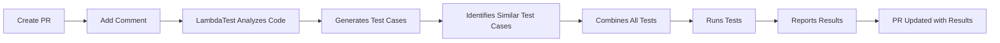

# 🚀 LambdaTest AI Cloud GitHub App Integration

<div align="center">


**Automate test case generation for your pull requests with AI-native testing**

[](https://github.com/apps/lambdatest-ai-cloud)
[](https://www.lambdatest.com/support/api-doc/?key=test-management)
[](https://www.lambdatest.com/contact-us)

</div>

---

## 📋 Table of Contents

- [🎯 Overview](#-overview)
- [✨ Features](#-features)
- [🚀 Quick Start](#-quick-start)
- [⚙️ Configuration](#️-configuration)
- [📖 Usage Guide](#-usage-guide)
- [🔧 Configuration Parameters](#-configuration-parameters)
- [📊 How to Find Configuration Values](#-how-to-find-configuration-values)
- [✅ Verification Steps](#-verification-steps)
- [🤝 Contributing](#-contributing)
- [📞 Support](#-support)

---

## 🎯 Overview

The **LambdaTest AI Cloud GitHub App** revolutionizes your testing workflow by automatically generating comprehensive test cases for your pull requests. This intelligent integration analyzes your code changes and creates relevant automated tests, ensuring your applications are thoroughly tested before deployment.

### 🌟 Why Choose LambdaTest AI Cloud?

- **🤖 AI-Powered Test Generation**: Automatically creates test cases based on your code changes
- **🔄 Seamless Integration**: Works directly with your GitHub pull requests
- **⚡ Real-time Testing**: Instant test execution and reporting
- **📈 Comprehensive Coverage**: Supports UI, API, and cross-browser testing
- **🎯 Smart Analysis**: Understands your codebase and generates contextually relevant tests

> **📖 Learn More**: Discover [why KaneAI is transforming test automation](https://www.lambdatest.com/support/docs/why-we-need-kane-ai/) and how it addresses traditional testing challenges.

---

## ✨ Features

| Feature | Description | Benefit |
|---------|-------------|---------|
| 🧠 **AI Test Generation** | Automatically generates test cases from PR changes | Saves time and ensures comprehensive coverage |
| 🔄 **Automated Execution** | Runs tests immediately after generation | Instant feedback on code quality |
| 📊 **Detailed Reporting** | Provides comprehensive test reports | Clear visibility into test results |
| 🌐 **Cross-browser Testing** | Tests across multiple browsers and devices | Ensures compatibility across platforms |
| 🔗 **GitHub Integration** | Native GitHub App with PR comments | Seamless workflow integration |
| 📈 **Scalable Testing** | Handles projects of any size | Grows with your development needs |

---

## 🚀 Quick Start

### Prerequisites

- ✅ GitHub Admin access to your repository
- ✅ Active LambdaTest account
- ✅ Deployed application URL for testing

### Step 1: Install the GitHub App

<div align="center">

[](https://github.com/apps/lambdatest-ai-cloud)

</div>

1. **Navigate to the App**: Click the button above or visit [LambdaTest AI Cloud GitHub App](https://github.com/apps/lambdatest-ai-cloud)

2. **Install the App**: 
   - Click **"Install"** or **"Configure"** if already installed
   - Select repositories (All repositories or specific ones)
   - Complete the installation process

3. **Authorize**: Complete the authorization to link your GitHub account with LambdaTest

### Step 2: Configure Your Repository

Create a configuration file at `.lambdatest/config.yaml` in your repository root:

```yaml
# LambdaTest Configuration
# ========================

# Project and folder configuration
project_id: "your_project_id"
folder_id: "your_folder_id"

# Test Run configuration
assignee: 123456
environment_id: 78901

# Test URL for automation
test_url: "https://demo.lambdatestinternal.com/"

# Enable test duplication for reliability (optional)
use_duplication: true
template_test_run_id: "your_template_run_id"
```

### Step 3: Start Testing

Create a pull request and add a comment:

```
@LambdaTest Generate test cases
```

🎉 **That's it!** The LambdaTest bot will automatically analyze your changes and generate comprehensive test cases.

---

## ⚙️ Configuration

### 📁 File Structure

```
your-repository/
├── .lambdatest/
│   └── config.yaml          # LambdaTest configuration
├── src/                     # Your application code
└── README.md               # This file
```

### 🔧 Configuration File

The `.lambdatest/config.yaml` file is the heart of your LambdaTest integration. It contains all the necessary settings for test generation and execution.

---

## 📖 Usage Guide

### 🎯 Basic Usage

1. **Create a Pull Request** with your code changes
2. **Add a Comment** to trigger test generation:
   ```
   @LambdaTest Generate test cases
   # OR
   @kaneai Generate test cases
   ```
3. **Watch the Magic** as LambdaTest:
   - Analyzes your code changes
   - Generates relevant test cases
   - Identifies similar existing test cases
   - Combines all tests for comprehensive coverage
   - Runs the complete test suite
4. **Review Results** in the PR comments and LambdaTest dashboard

### 🔄 Workflow Integration



---

## 🔧 Configuration Parameters

> **📚 API Reference**: All configuration IDs (`project_id`, `folder_id`, `assignee`, `environment_id`) can be found in the [LambdaTest API Documentation](https://www.lambdatest.com/support/api-doc/). Use the Test Manager API endpoints to retrieve these values.

| Parameter | Description | Required | Example | Type |
|-----------|-------------|----------|---------|------|
| `project_id` | Your LambdaTest project identifier | ✅ Yes | `"01K88GEM5X8BDHWWVY819YTYVA"` | String |
| `folder_id` | Folder ID where tests will be organized | ✅ Yes | `"01K88GFKKP1TDP3AYBP725VAPW"` | String |
| `assignee` | User ID to assign test runs | ✅ Yes | `17398756` | Number |
| `environment_id` | Test environment configuration ID | ✅ Yes | `156989` | Number |
| `test_url` | URL of your deployed application | ✅ Yes | `"https://demo.lambdatestinternal.com/"` | String |
---

## 📊 How to Find Configuration Values

### 💡 Pro Tip
**For programmatic access to these values, use the [LambdaTest API Documentation](https://www.lambdatest.com/support/api-doc/) with Test Manager endpoints.**

### 🔍 Project ID & Folder ID

1. **Log into** [LambdaTest Dashboard](https://accounts.lambdatest.com/login)
2. **Navigate** to your project
3. **Copy the IDs** from the URL or project settings
   ```
   URL: https://test-manager.lambdatest.com/project/01K88GEM5X8BDHWWVY819YTYVA
   Project ID: 01K88GEM5X8BDHWWVY819YTYVA
   ```
4. **API Method**: Use `GET /test-manager/projects` endpoint to retrieve project and folder IDs programmatically
---

### 🎯 Basic Commands

```bash
# Generate test cases for the entire PR
@LambdaTest Generate test cases
@kaneai Generate test cases
```

### 📝 Comment Examples

<details>
<summary>📋 Click to see example PR comments</summary>

```markdown
## 🧪 Test Generation Request

@LambdaTest Generate test cases
# OR
@kaneai Generate test cases

**Changes in this PR:**
- Added new user authentication flow
- Updated payment processing logic
- Modified UI components for better UX

**Test Requirements:**
- UI testing for new components
- API testing for authentication endpoints
- Cross-browser compatibility testing
```

</details>

---

## ✅ Verification Steps

### 🔍 Pre-deployment Checklist

- [ ] ✅ `.lambdatest/config.yaml` file is committed to your repository
- [ ] ✅ LambdaTest bot appears in your repository's integrations
- [ ] ✅ All configuration parameters are correctly set
- [ ] ✅ Test URL is accessible and working
- [ ] ✅ LambdaTest account is properly linked

### 🧪 Testing the Integration

1. **Create a Test PR** with some code changes
2. **Add the Comment**: `@LambdaTest Generate test cases`
3. **Wait for Response** (usually 2-5 minutes)
4. **Check Results** in PR comments and LambdaTest dashboard
5. **Verify Test Execution** and review generated reports

### 🚨 Troubleshooting

| Issue | Solution |
|-------|----------|
| Bot doesn't respond | Check if app is installed and authorized |
| Configuration errors | Verify `.lambdatest/config.yaml` syntax |
| Test failures | Check test URL accessibility and environment settings |
| Missing permissions | Ensure GitHub Admin access for app installation |

---

## 🤝 Contributing

We welcome contributions! Here's how you can help:

1. **🐛 Report Issues**: Found a bug? [Create an issue](https://github.com/lambdatest/lambdatest-github-app-sample/issues)
2. **💡 Suggest Features**: Have an idea? [Start a discussion](https://github.com/lambdatest/lambdatest-github-app-sample/discussions)
3. **📝 Improve Documentation**: Help us make this README better
4. **🔧 Submit PRs**: Fix bugs or add features

### Development Setup

```bash
# Clone the repository
git clone https://github.com/lambdatest/lambdatest-github-app-sample.git

# Navigate to the project
cd lambdatest-github-app-sample

# Install dependencies
npm install

# Start development server
npm run dev
```

---

## 📞 Support

### 🆘 Need Help?

- **📚 Documentation**: [LambdaTest Support Docs](https://www.lambdatest.com/support/docs/)
- **💬 Community**: [GitHub Discussions](https://github.com/lambdatest/lambdatest-github-app-sample/discussions)
- **🐛 Bug Reports**: [GitHub Issues](https://github.com/lambdatest/lambdatest-github-app-sample/issues)
- **📧 Email Support**: [support@lambdatest.com](mailto:support@lambdatest.com)

### 🔗 Useful Links

- [LambdaTest Website](https://www.lambdatest.com/)
- [GitHub App Marketplace](https://github.com/marketplace)
- [LambdaTest Documentation](https://www.lambdatest.com/support/docs/)
- [API Documentation](https://www.lambdatest.com/support/docs/api-reference/)

---

<div align="center">

**Made with ❤️ by the LambdaTest Team**

[](https://www.lambdatest.com/)
[](https://github.com/apps/lambdatest-ai-cloud)

*Automate your testing workflow with AI-powered test generation*

</div>
